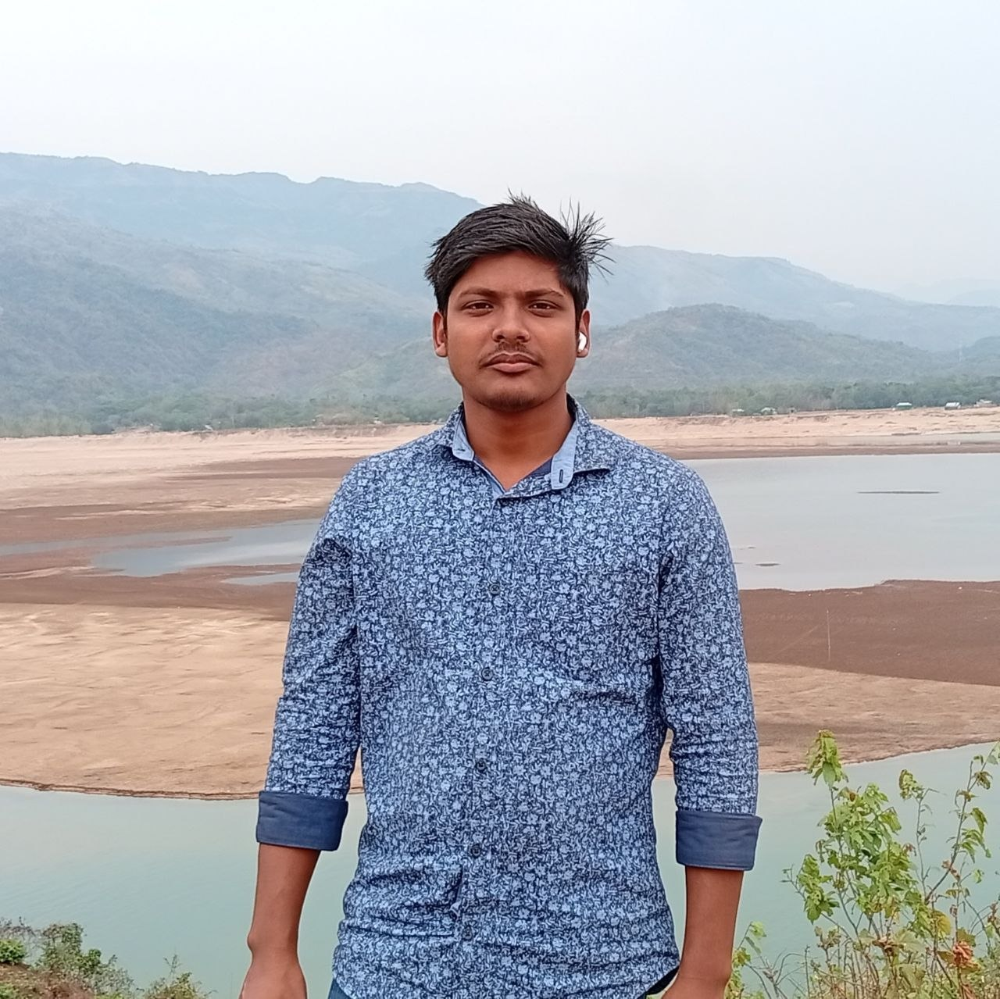

# 🚀 Md Mohebur Rahman Monir

<h1 align="center">

</h1>  

Welcome to my personal developer portfolio website!  
This project showcases my skills, projects, and experience as a **Full Stack Web Developer**.

🌐 **Live Site:** [Visit Portfolio](https://mohebur-rahman.vercel.app)

---

## 📌 About The Project

This is my personal portfolio website built to present:
- My technical skills
- Real-world projects
- Experience and learning journey
- Contact information

Clean UI, responsive design, and modern web development practices are the core focus of this project.

---

## ⚡ Features

- 📱 Fully Responsive Design
- 🎨 Modern UI/UX
- ⚡ Fast & Optimized Performance
- 📂 Project Showcase Section
- 🧠 Skills Highlight Section
- 📬 Contact Section
- 🌙 Clean & Minimal Design

---

## 🛠️ Tech Stack

### 🌐 Frontend

---

### 🧩 Backend

---

### 🗄️ Database

---

### 🔐 Authentication

---

### ⚙️ Tools & Deployment
- Git & GitHub
- Vercel Deployment
- REST API Integration

---

## 💼 Skills

- ✔ HTML5, CSS3, JavaScript (ES6+)
- ✔ Tailwind CSS for UI design
- ✔ React / Next.js (if applicable)
- ✔ Node.js & Express.js
- ✔ MongoDB Database Management
- ✔ Authentication (BetterAuth)
- ✔ REST API Development
- ✔ Responsive Web Design
- ✔ Version Control (Git & GitHub)

---

## 📂 Projects

Some featured projects included in this portfolio:

- 🏟️ Booking / Facility Management System
- 📊 Admin Dashboard UI
- 🌐 Responsive Web Applications
- ⚙️ Full Stack CRUD Applications

---
 
